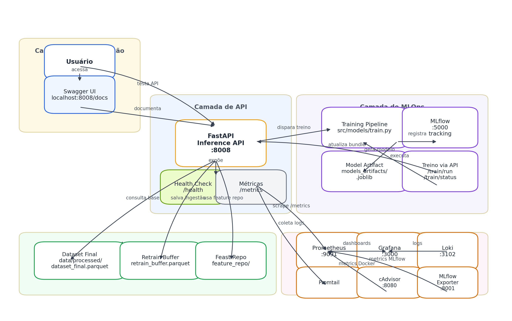
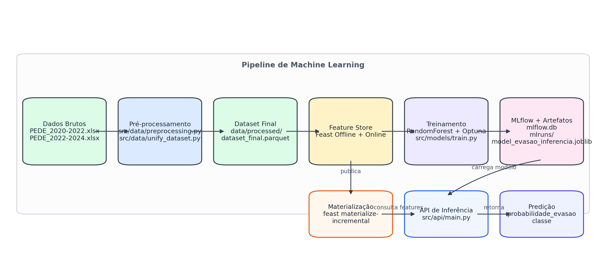
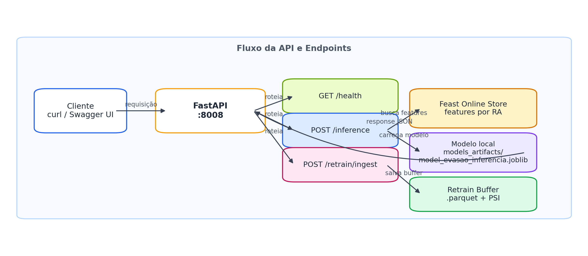
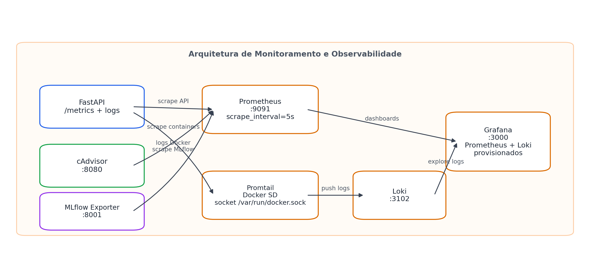
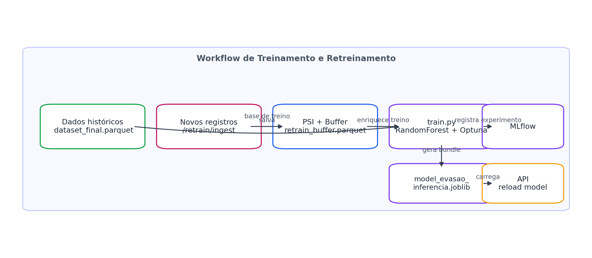
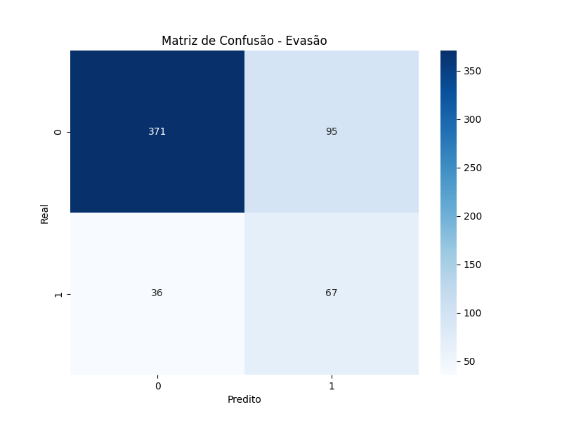
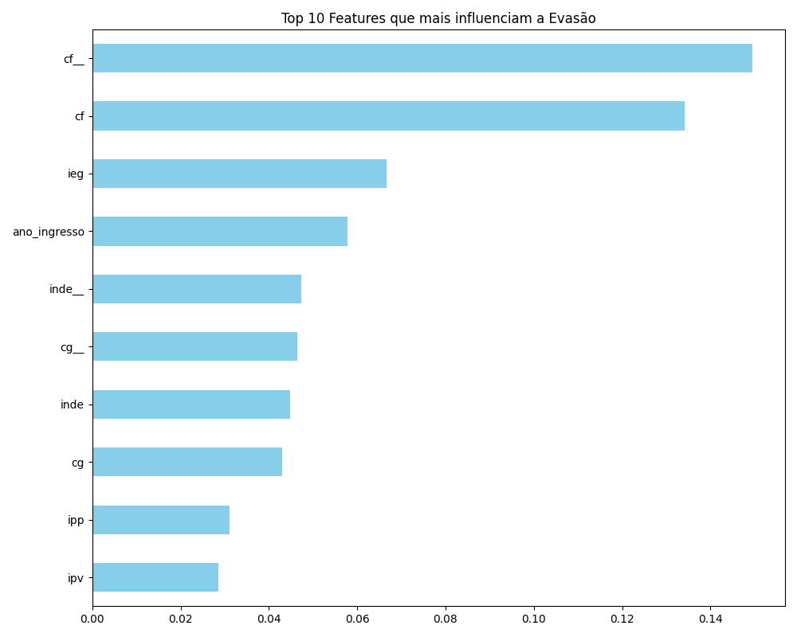

# Datathon Passos Magicos

Projeto com pipeline de ML para estimar risco de evasao/defasagem, usando:
- Feast (feature store)
- Scikit-learn + Optuna (treino)
- MLflow (tracking e artefatos)
- FastAPI (inferencia e ingestao para re-treino)
- Docker (execucao da API)


## Contexto academico e objetivo

Este repositorio pode ser lido tanto como um projeto aplicado de **MLOps para previsao de evasao/defasagem** quanto como um artefato de **Pos-Graduacao**, com enfase em:

- engenharia e governanca de features
- treinamento supervisionado com tuning
- servico de inferencia online
- observabilidade de API e containers
- re-treino orientado por dados e checagem basica de drift

## Visao arquitetural do projeto

### Arquitetura completa da plataforma



A arquitetura foi organizada em cinco camadas:

- **Apresentacao**: Swagger UI e uso via `curl`
- **API**: FastAPI com endpoints de healthcheck, inferencia, ingestao e treino
- **MLOps**: pipeline de treino, MLflow e artefato local do modelo
- **Dados / Feature Store**: datasets processados, buffer de re-treino e repositorio Feast
- **Observabilidade**: Prometheus, Grafana, Loki, Promtail, cAdvisor e exporter do MLflow

### Pipeline detalhado de Machine Learning



### Arquitetura da API



### Arquitetura de observabilidade



### Workflow de treinamento e re-treinamento



## Stack executada pelo docker-compose

Ao executar `docker compose up --build`, o ambiente sobe nao apenas a API, mas uma stack de observabilidade completa.

| Servico | Funcao principal | Porta local | Acesso |
|---|---|---:|---|
| `api` | API FastAPI de inferencia e ingestao | `8008` | `http://localhost:8008` |
| `grafana` | dashboards e exploracao de logs | `3000` | `http://localhost:3000` |
| `prometheus` | coleta de metricas | `9091` | `http://localhost:9091` |
| `loki` | armazenamento de logs | `3102` | `http://localhost:3102` |
| `cadvisor` | metricas de containers Docker | `8080` | `http://localhost:8080` |
| `mlflow-exporter` | metricas do MLflow para Prometheus | `8001` | `http://localhost:8001/metrics` |

### Acessos uteis apos subir os containers

- **Swagger UI**: `http://localhost:8008/docs`
- **Healthcheck da API**: `http://localhost:8008/health`
- **Metricas da API**: `http://localhost:8008/metrics`
- **Prometheus**: `http://localhost:9091`
- **Grafana**: `http://localhost:3000`
- **Loki**: `http://localhost:3102`
- **cAdvisor**: `http://localhost:8080`
- **MLflow exporter**: `http://localhost:8001/metrics`

### Credenciais e configuracoes relevantes

- Usuario do Grafana: `admin`
- Senha do Grafana: `qwe123`
- Datasources provisionados no Grafana:
  - `Prometheus` via `http://prometheus:9090`
  - `Loki` via `http://loki:3100`
- Dashboard default configurado em `monitoring/grafana/config/grafana.ini`
- Provisionamento de dashboards em `monitoring/grafana/provisioning/dashboards/default.yaml`

## Stack de monitoramento detalhada

A observabilidade do projeto foi estruturada em duas trilhas:

### 1. Metricas

- A API usa `prometheus-fastapi-instrumentator` e expõe metricas em `/metrics`
- O Prometheus coleta metricas da API a cada **5 segundos**
- O Prometheus tambem coleta metricas do `cadvisor`
- O `mlflow-exporter` publica metricas derivadas do `mlflow.db`

Resumo do `prometheus.yml`:

- `job_name: api` -> target `api:8008`
- `job_name: cadvisor` -> target `cadvisor:8080`
- `job_name: mlflow-exporter` -> target `mlflow-exporter:8001`

### 2. Logs

- O `promtail` observa containers Docker usando `docker_sd_configs`
- Os logs sao enviados para o `Loki`
- O Grafana consulta o Loki para exploracao e troubleshooting

Resumo do `promtail-config.yaml`:

- descoberta via `unix:///var/run/docker.sock`
- label `container_name` baseada em `__meta_docker_container_name`
- label `job=docker`

## Resultados visuais do treinamento

As imagens abaixo ja fazem parte do projeto e podem ser mantidas no README como evidencias do processo de treinamento:

### Matriz de confusao



### Importancia das features



## Guia rapido de operacao da stack

Depois de subir o ambiente, uma sequencia util de validacao manual e:

1. abrir `http://localhost:8008/docs`
2. validar `GET /health`
3. verificar `GET /metrics`
4. abrir Grafana em `http://localhost:3000`
5. abrir Prometheus em `http://localhost:9091`
6. conferir cAdvisor em `http://localhost:8080`
7. consultar logs no Grafana usando Loki
8. executar um `POST /inference`
9. enviar um lote em `POST /retrain/ingest`
10. disparar `POST /train/run` e acompanhar `GET /train/status`

---

## Estrutura principal

- `src/models/train.py`: treino, tuning, log no MLflow e geracao de bundle local para inferencia.
- `src/api/main.py`: endpoints de healthcheck, inferencia, ingestao para re-treino/drift e disparo de treino.
- `feature_repo/`: configuracao do Feast (`feature_store.yaml`, feature views).
- `models_artifacts/model_evasao_inferencia.joblib`: arquivo local do modelo para API.

## Pre-requisitos

- Python 3.12
- Docker + Docker Compose
- Feast CLI instalado (vem do `requirements.txt`)
- (Opcional) `jq` para formatar saidas JSON de comandos `curl`

## Fluxo completo (do zero ate inferencia)

1. Instalar dependencias:

```bash
pip install -r requirements.txt
```

2. Aplicar definicoes do Feast:

```bash
feast -c feature_repo apply
```

3. Materializar online store (dados para inferencia online por `ra`):

```bash
feast -c feature_repo materialize-incremental $(date +%Y-%m-%d)
```

4. Treinar modelo e gerar bundle de inferencia:

```bash
python3 src/models/train.py
```

Saidas esperadas do treino:
- Modelo no MLflow (`model_evasao_final`)
- Arquivo local para inferencia: `models_artifacts/model_evasao_inferencia.joblib`
- Graficos: `confusion_matrix.png` e `feature_importance.png`

5. Subir stack completa (API + monitoramento) em containers:

```bash
docker compose up --build
```

Acessos recomendados apos a inicializacao:

- API: `http://localhost:8008`
- Swagger UI: `http://localhost:8008/docs`
- Metricas da API: `http://localhost:8008/metrics`
- Grafana: `http://localhost:3000`
- Prometheus: `http://localhost:9091`
- Loki: `http://localhost:3102`
- cAdvisor: `http://localhost:8080`
- MLflow exporter: `http://localhost:8001/metrics`


6. Validar API:

```bash
curl -s http://localhost:8008/health | jq .
```

7. Fazer inferencia por aluno:

```bash
curl -s -X POST http://localhost:8008/inference \
  -H "Content-Type: application/json" \
  -d '{"ra":"RA-1519","threshold":0.6}' | jq .
```

8. Enviar novos dados para buffer de re-treino e checagem de drift:

```bash
curl -s -X POST http://localhost:8008/retrain/ingest \
  -H "Content-Type: application/json" \
  -d '{
    "source":"api_manual",
    "detect_drift": true,
    "records":[
      {
        "ra":"RA-DRIFT-001",
        "event_timestamp":"2026-02-19T12:00:00Z",
        "inde":8.4,
        "cg":120.0,
        "cf":30.0,
        "ct":15.0,
        "mat":9.2,
        "por":8.9,
        "ing":9.1,
        "ida":9.0,
        "defasagem":0.0,
        "idade":14,
        "pedra_num":4,
        "ipv":9.4,
        "ian":9.0,
        "genero_masculino":1
      }
    ]
  }' | jq .
```

9. Disparar treino pela API (opcional):

```bash
curl -s -X POST http://localhost:8008/train/run | jq .
```

10. Acompanhar status do treino disparado:

```bash
curl -s http://localhost:8008/train/status | jq .
```

11. Derrubar a stack de containers:

```bash
docker compose down
```

## Endpoints da API

Base URL (local): `http://localhost:8008`

### `GET /health`

Verifica status da API, modelo e repo do Feast.

Exemplo:

```bash
curl -s http://localhost:8008/health
```

### `POST /inference`

Predicao por `ra` (a API busca features no Feast online store).

Request:

```json
{
  "ra": "RA-1286",
  "threshold": 0.5
}
```

Exemplo:

```bash
curl -s -X POST http://localhost:8008/inference \
  -H "Content-Type: application/json" \
  -d '{"ra":"RA-1286","threshold":0.5}'
```

Response (exemplo):

```json
{
  "ra": "RA-1286",
  "probabilidade_evasao": 0.73,
  "predicao": 1,
  "classe": "alto_risco",
  "threshold_usado": 0.5,
  "missing_features": []
}
```

### `POST /retrain/ingest`

Recebe novos registros, salva em buffer local e calcula drift basico via PSI.

Exemplo:

```bash
curl -s -X POST http://localhost:8008/retrain/ingest \
  -H "Content-Type: application/json" \
  -d '{
    "source":"api_manual",
    "detect_drift": true,
    "records":[
      {
        "ra":"RA-DRIFT-001",
        "event_timestamp":"2026-02-19T12:00:00Z",
        "inde":8.4,
        "cg":120.0,
        "cf":30.0,
        "ct":15.0,
        "mat":9.2,
        "por":8.9,
        "ing":9.1,
        "ida":9.0,
        "defasagem":0.0,
        "idade":14,
        "pedra_num":4,
        "ipv":9.4,
        "ian":9.0,
        "genero_masculino":1
      }
    ]
  }'
```

Buffer salvo em:
- `data/processed/retrain_buffer.parquet`

### `POST /train/run`

Dispara o `src/models/train.py` em background pela API.

Exemplo:

```bash
curl -s -X POST http://localhost:8008/train/run | jq .
```

### `GET /train/status`

Consulta estado do ultimo treino iniciado via API (`idle`, `running`, `success`, `failed`), com timestamps e `return_code`.

Exemplo:

```bash
curl -s http://localhost:8008/train/status | jq .
```

Log do treino via API:
- `data/processed/train_api.log`

## O que significa manter a online store atualizada

Endpoint `/inference` por `ra` consulta o Feast online store.
Se a online store estiver desatualizada, a inferencia usa valores antigos ou ausentes.

Atualize com:

```bash
feast -c feature_repo materialize-incremental $(date +%Y-%m-%d)
```

## Data drift (regra atual)

A API calcula PSI por feature numerica comum entre:
- base de referencia: `data/processed/dataset_final.parquet`
- novo lote recebido em `/retrain/ingest`

Interpretacao pratica:
- PSI < 0.10: estavel
- 0.10 <= PSI < 0.20: alerta
- PSI >= 0.20: drift relevante

## Rodar API sem Docker

```bash
uvicorn src.api.main:app --host 0.0.0.0 --port 8008 --reload
```

## Troubleshooting rapido

Erro de feature view inexistente no Feast:
1. `feast -c feature_repo apply`
2. `feast -c feature_repo materialize-incremental $(date +%Y-%m-%d)`

Erro de modelo nao encontrado na API:
1. `python3 src/models/train.py`
2. confirmar arquivo em `models_artifacts/model_evasao_inferencia.joblib`

Erro em comandos `curl ... | jq`:
- Instalar `jq` ou remover `| jq .` dos comandos.
